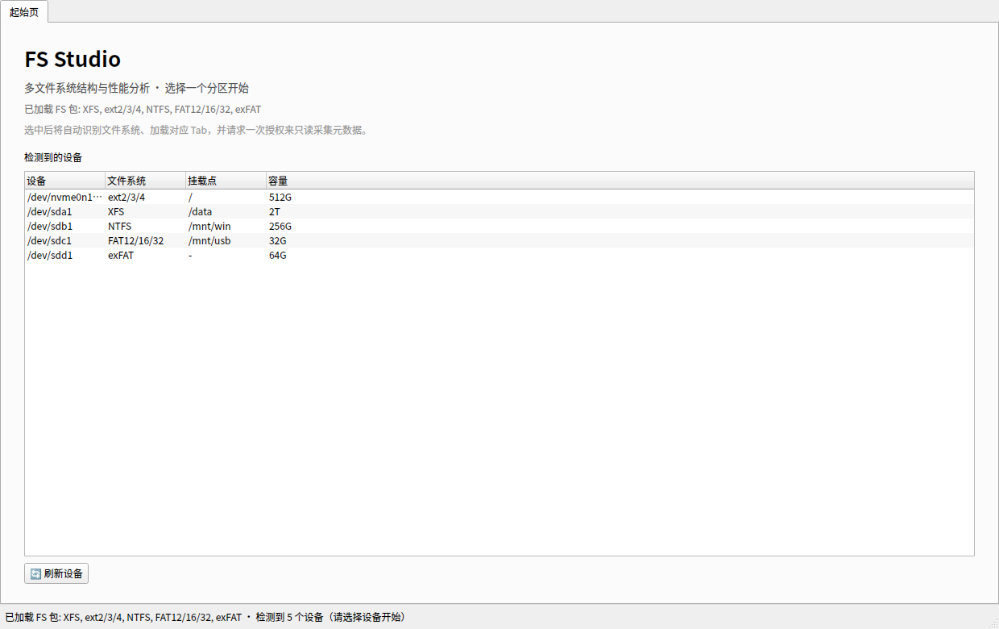
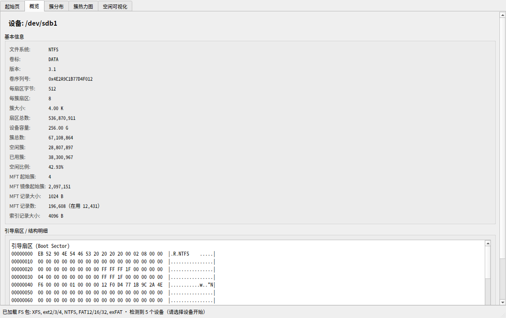
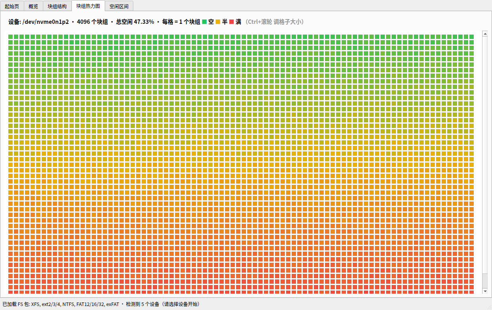
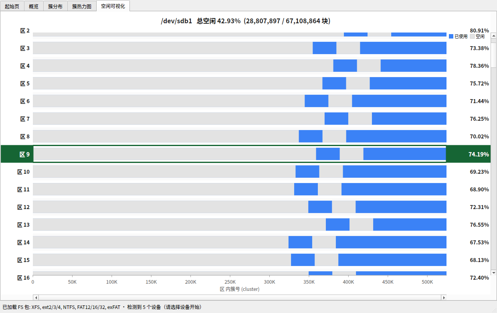

# FS Studio

多文件系统结构与性能分析器。以"设备 + 文件系统包"的方式，只读采集分区元数据，
用表格、热力图和区间图把**空闲空间的全局分布**直观画出来。

当前支持：**XFS、ext2/3/4、NTFS、FAT12/16/32、exFAT**。

---

## 特性

- **插件化 FS 包**：每个文件系统一个 `fs_packs/<fs>.py`，内含 collector + Tab 集合，
  单文件即可独立带走。主窗口不认文件系统，只认"设备 + 包"。
- **自动识别**：启动后用 `lsblk` 枚举所有带文件系统的块设备，选中设备后按磁盘格式
  自动匹配对应包并加载它的 Tab。
- **只读采集**：不修改任何文件系统；启动时不采集、不弹授权，选中设备后才请求一次
  root 授权（`pkexec`，无则退回 `sudo`）。
- **零外部依赖解析**：NTFS / FAT / exFAT 的引导扇区、`$MFT`、`$Bitmap`、FAT 表、
  分配位图都由 Python 直接解析，不依赖 `ntfsprogs` / `dosfstools` / `exfatprogs`。
- **大容量也快**：位图/表扫描用 C 级正则整段跳过 + 查表逐字节处理，避免逐簇 Python 循环。
  本机实测 256GB / 4KB 簇（约 6700 万簇）：FAT32 表扫描约 0.1s、exFAT 位图约 0.01s
  （旧的逐簇实现在同一数据上分别约 3.7s / 数秒）。
- **热力图 → 区间图联动**：点击热力图某一格，自动切换到「空闲可视化」并定位到该行，
  采用 GRUB 式反色高亮（外部留白反色、内部数据条保持原色）。

---

## 界面预览

### 起始页



启动后列出所有已支持的文件系统分区；此时不采集、不弹授权，选中设备后才开始。

### 概览



超级块 / 引导扇区字段、卷标、容量、空闲比例，以及引导扇区十六进制明细。

### 块组热力图



一格 = 一个块组 / AG / 区，颜色 绿(空) → 黄(半) → 红(满)，一眼看出全局分布。

### 空闲可视化



每行一段块 / 簇空间，蓝色为已用、灰色为空闲区间。点击热力图某一格会跳转到对应行，
并以 GRUB 式反色高亮（外部留白反色、内部数据条保持原色）。

> 截图由 `docs/make_screenshots.py` 用合成数据离线渲染生成（`QT_QPA_PLATFORM=offscreen`，
> 无需显示器 / 真实设备 / root）：`python3 docs/make_screenshots.py`。

---

## 支持的文件系统

| 文件系统 | 磁盘格式 (`lsblk fstype`) | 依赖工具 | Tab |
|---|---|---|---|
| XFS | `xfs` | `xfs_db`、`xfs_info`（xfsprogs） | 概览 / AG 结构 / 空闲可视化 |
| ext2/3/4 | `ext4`、`ext3`、`ext2` | `dumpe2fs`（e2fsprogs），可选 `e2freefrag` | 概览 / 块组结构 / 块组热力图 / 空闲区间 |
| NTFS | `ntfs`、`ntfs3` | 无（直接解析 `$MFT` / `$Bitmap`） | 概览 / 簇分布 / 簇热力图 / 空闲可视化 |
| FAT12/16/32 | `vfat`、`fat`、`msdos`、`fat12/16/32` | 无（直接解析 BPB / FAT 表） | 概览 / 簇分布 / 簇热力图 / 空闲可视化 |
| exFAT | `exfat` | 无（直接解析引导扇区 / 分配位图） | 概览 / 簇分布 / 簇热力图 / 空闲可视化 |

> FAT12/16/32 的具体类型由 BPB 自动判定；`lsblk` 一律报 `vfat`。

### 各 Tab 说明

- **概览**：超级块/引导扇区字段、卷标、容量、簇/块大小、空闲比例，以及引导扇区十六进制明细。
- **块组/AG/簇分布**：按行统计区间内的空闲与使用情况（块组、AG 或"区"）。
- **热力图**：一格 = 一个块组/AG/区，颜色 绿(空) → 黄(半) → 红(满)。
  `Ctrl` + 滚轮可调格子大小，鼠标悬停显示该格详情。
- **空闲可视化 / 空闲区间**：每行一段块/簇空间，蓝色为已用、灰色为空闲块区间；
  支持缩放、平移与悬停查看具体区间。

### 图表操作

| 操作 | 效果 |
|---|---|
| 滚轮 | 上下滚动 |
| `Ctrl` + 滚轮 | 以鼠标位置为中心缩放 |
| `Shift` + 滚轮 / 左键拖动 | 水平平移 |
| 双击 | 重置缩放并回到顶部 |
| 右键 | 重置缩放 / 回到顶部 |
| 热力图 `Ctrl` + 滚轮 | 调整格子大小 |
| 热力图 左键单击 | 跳转到「空闲可视化」对应行并高亮 |

---

## 环境要求

- Linux（依赖 `lsblk` 枚举设备，`pkexec`/`sudo` 提权采集）
- Python 3.10+
- [PySide6](https://pypi.org/project/PySide6/)

```bash
pip install PySide6
```

可选依赖（仅对应文件系统的采集需要）：

```bash
# Fedora / RHEL
sudo dnf install xfsprogs e2fsprogs
# Debian / Ubuntu
sudo apt install xfsprogs e2fsprogs
```

---

## 运行

```bash
python3 fs_studio_v2.0.py
```

流程：

1. 启动进入**起始页**（此时不采集、不弹授权），列出所有已支持的文件系统分区。
2. 点击某个设备：自动识别文件系统 → 加载对应 Tab → 请求一次授权只读采集元数据。
3. 采集完成后即可在各 Tab 间查看；点击热力图可联动跳转到空闲区间视图。
4. 点「🔄 刷新设备」重新扫描分区。

### 命令行（worker 模式）

采集器可以脱离 GUI 单独运行，直接输出 JSON：

```bash
sudo python3 fs_studio_v2.0.py --worker ntfs full /dev/sdb1
sudo python3 fs_studio_v2.0.py --worker fat  full /dev/sdc1
```

> 设备需要 root 读权限；GUI 会自动通过 `pkexec`/`sudo` 提权。

---

## 目录结构

```
fs_studio_v2.0.py        主窗口：设备枚举、起始页、Tab 容器、采集线程
fs_packs/
  __init__.py            包导出（自动发现）
  core.py                框架：注册表 + 通用区间图 + 采集线程 + worker
  xfs.py                 XFS   的 collector + Tab 集合
  ext4.py                ext2/3/4 的 collector + Tab 集合
  ntfs.py                NTFS  的 collector + Tab 集合
  fat.py                 FAT12/16/32 与 exFAT 的 collector + Tab 集合
```

### 架构

`core.py` 提供三张注册表：

| 装饰器 | 作用 |
|---|---|
| `@register_pack` | 注册一个 FS 包（`FS_ID` / `FS_NAME` / `matches_fstype`） |
| `@register_collector(fs_id, action)` | 注册 root 侧采集函数 `fn(dev) -> dict` |
| `@register_tab` | 注册 Tab（`TAB_FS` 决定它属于哪个包） |

`load_packs()` 通过 `pkgutil` 自动导入 `fs_packs/` 下的所有模块，因此**新增一个文件即新增一个文件系统支持**。

采集由子进程完成：主窗口以 `python3 fs_studio_v2.0.py --worker <fs_id> <action> <dev>`
提权运行采集函数，结果以 JSON 写回 stdout，主进程解析后分发给各 Tab 的
`update_data(payloads)`。

---

## 新增一个文件系统包

新建 `fs_packs/myfs.py`：

```python
from .core import (FSPack, TabPlugin, register_collector, register_pack,
                   register_tab)


@register_collector('myfs', 'full')
def collect_full(dev):
    # root 侧只读采集，返回可 JSON 序列化的 dict
    return {'dev': dev, 'fs': 'myfs', 'fields': [('卷标', 'demo')]}


@register_tab
class MyFsOverviewTab(TabPlugin):
    TAB_FS = 'myfs'
    TAB_ID = 'overview'
    TAB_TITLE = '概览'
    TAB_ORDER = 10
    NEEDS = ('full',)

    def update_data(self, payloads):
        payload = payloads.get('full')
        if payload:
            print(payload['fields'])

    def clear(self):
        pass


@register_pack
class MyFsPack(FSPack):
    FS_ID = 'myfs'
    FS_NAME = 'MyFS'
    ORDER = 50

    @classmethod
    def matches_fstype(cls, fstype):
        return (fstype or '').lower() == 'myfs'
```

要点：

- `NEEDS` 里声明的动作会被去重后依次采集，`update_data` 收到 `{动作: 结果}`。
- 需要"全局分布"视图时，可复用 `core.BlockRangeChart`（区间图），
  或参考 `ext4.py` / `fat.py` 的热力图实现。
- 采集函数中抛出的异常会显示在状态栏和错误对话框中。

### 本地快速验证

采集器可以直接对镜像文件运行（无需 root、无需真实设备）：

```bash
# 用 mkfs 造一个测试镜像
truncate -s 64M test.img && mkfs.vfat -F 32 test.img

python3 -c "from fs_packs.fat import collect_fat; \
d=collect_fat('test.img'); print(d['cluster_count'], d['free_clusters'])"
```

无显示器环境下的 GUI 冒烟测试：

```bash
QT_QPA_PLATFORM=offscreen python3 fs_studio_v2.0.py
```

---

## 权限与安全

- 采集是**只读**的：仅读取引导扇区、元数据表与位图，不做任何写入/挂载。
- 通过 `pkexec`（优先）或 `sudo` 仅对采集子进程提权，主界面仍以普通用户运行。
- 若既无 `pkexec` 也无 `sudo`，采集会失败并在状态栏提示。

---

## 许可证

本项目基于 **GPL-3.0** 发布，详见 [LICENSE](LICENSE)。
